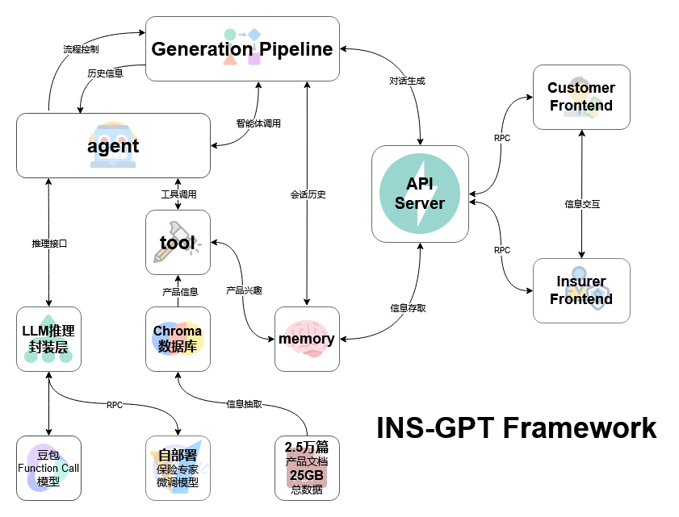

# INS-GPT功能简介
1.INS-GPT基于自部署的保险专家微调模型，能够回答与保险相关的各类问题，包括但不限于保险种类、条款解释、购买建议、理赔流程等问题。
2.INS-GPT根据用户需求和用户信息（如预算、年龄、保障范围、特殊需求等），从在售的保险产品中为用户推荐最合适的几款保险产品。同时INS-GPT具有文生图的能力，以更加直观的图表展现产品对比效果。返回保险产品文件信息，并回复用户选定的具体产品细节。
3.INS-GPT支持用户管理、意向查询以及对话生成的高效整合。保险公司可以登录管理端，查看用户信息、常见问题、购买意愿和历史聊天记录，得到一份表格式报告，这为保险公司提供了基于用户需求和交互数据的业务洞察，帮助他们优化产品设计与营销策略。
4.用户可通过智能搜索引擎检索理赔数据，得到文书高频词汇生成动态词云图与智能分析服务。

# Framework

